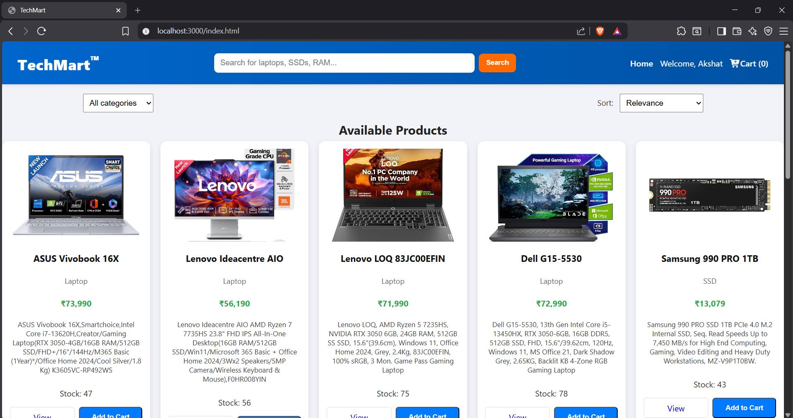
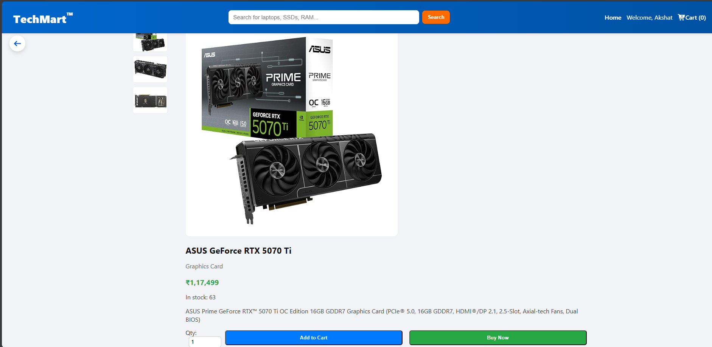
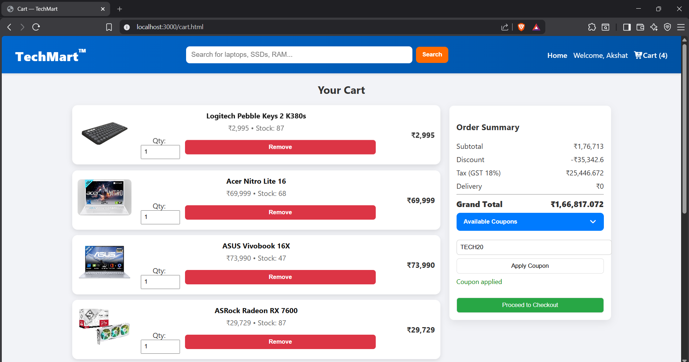
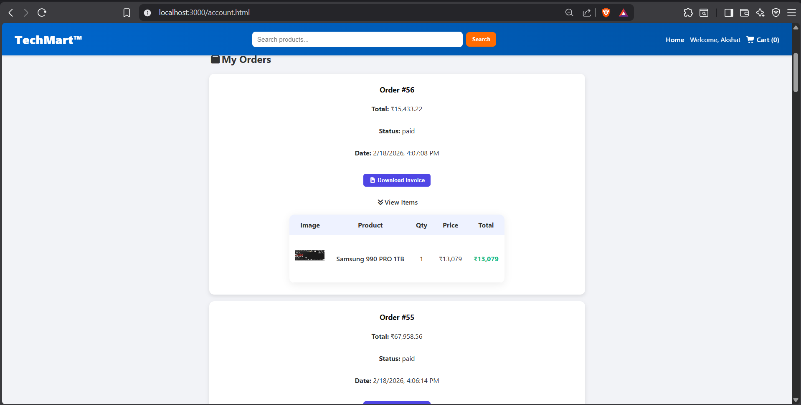
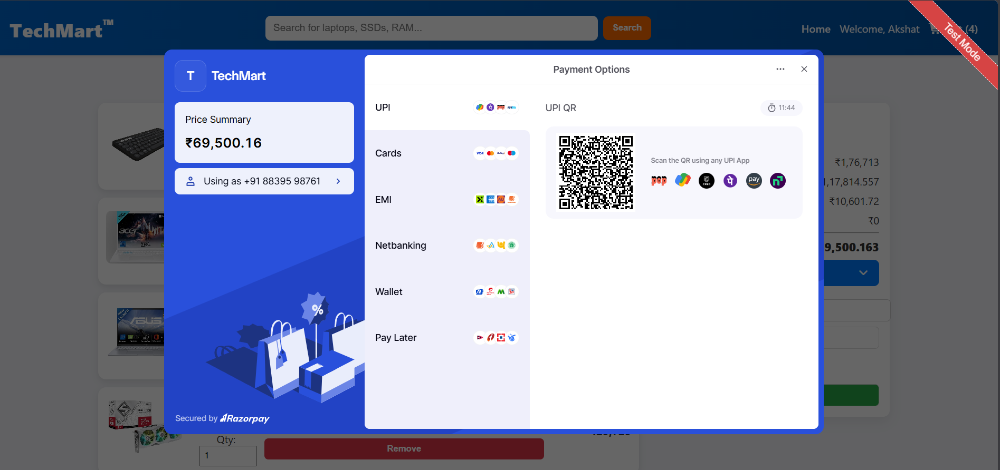
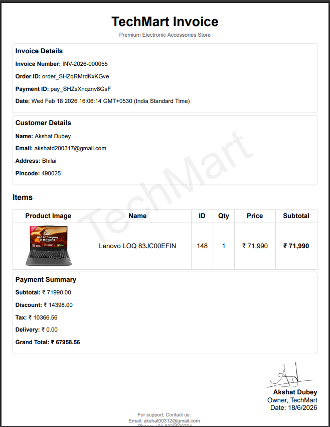
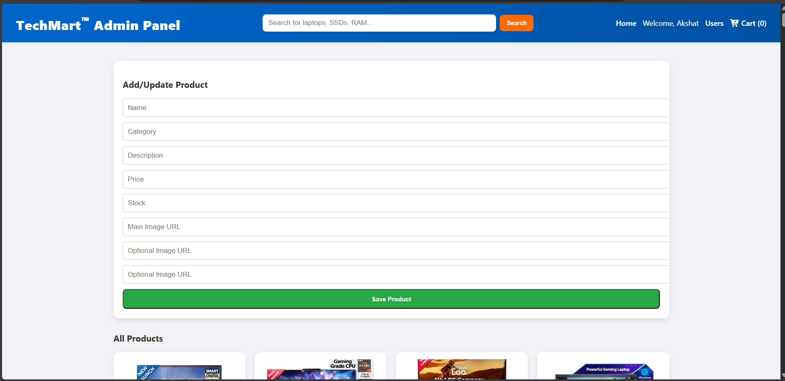

# TechMart 🛒

A full-stack e-commerce web application built with Node.js, Express, and MySQL. TechMart allows users to browse products, manage their cart, place orders, and process payments using Razorpay. Admin users can manage inventory, track orders, and handle customer accounts.

## Features ✨

- **User Authentication** — Sign up, login, and secure password management
- **Product Browsing** — Browse products with detailed information
- **Shopping Cart** — Add/remove products and manage quantities
- **Order Management** — Place orders and track order history
- **Payment Integration** — Secure payments via Razorpay
- **User Accounts** — Update profile, view order history, change password
- **Admin Dashboard** — Manage products, users, orders, and invoices
- **Coupons & Discounts** — Apply coupon codes to orders
- **Invoice Generation** — Generate and download order invoices
- **Password Reset** — Change/forgot password functionality without old password

## Screenshots 📸

**Homepage**



**Product Page**



**Cart Page**



**Orders Page**



**Razorpay Checkout Page**



**Receipt / Order Confirmation**



**Admin Dashboard**



## Tech Stack 🔧

- **Backend:** Node.js, Express.js
- **Database:** MySQL
- **Frontend:** HTML5, CSS3, JavaScript (Vanilla)
- **Authentication:** bcrypt (password hashing)
- **Payment Gateway:** Razorpay
- **Additional:** PDF generation, CORS support

## Prerequisites 📋

- Node.js (v14+)
- MySQL Server
- npm or yarn
- Razorpay account (for payment integration)

## Installation 🚀

1. **Clone the repository**
   ```bash
   git clone https://github.com/Akshat03-ai/TechMart.git
   cd TechMart
   ```

2. **Install dependencies**
   ```bash
   npm install
   ```

3. **Set up environment variables**
   
   Create a `.env` file in the root directory:
   ```
   DB_HOST=localhost
   DB_USER=root
   DB_PASSWORD=your_password
   DB_NAME=techmart
   
   RAZORPAY_KEY_ID=your_razorpay_key
   RAZORPAY_KEY_SECRET=your_razorpay_secret
   ```

4. **Set up MySQL database**
   
   Create the database and import schema:
   ```sql
   CREATE DATABASE techmart;
   USE techmart;
   
   -- Create users table
   CREATE TABLE users (
     id INT AUTO_INCREMENT PRIMARY KEY,
     name VARCHAR(100),
     email VARCHAR(100) UNIQUE,
     password VARCHAR(255),
     role ENUM('user', 'admin') DEFAULT 'user',
     address TEXT,
     pincode VARCHAR(10),
     is_blocked BOOLEAN DEFAULT 0
   );
   
   -- Create products table
   CREATE TABLE products (
     id INT AUTO_INCREMENT PRIMARY KEY,
     name VARCHAR(100),
     description TEXT,
     price DECIMAL(10, 2),
     image VARCHAR(255)
   );
   
   -- Create orders table
   CREATE TABLE orders (
     id INT AUTO_INCREMENT PRIMARY KEY,
     user_id INT,
     total_amount DECIMAL(10, 2),
     order_date TIMESTAMP DEFAULT CURRENT_TIMESTAMP,
     FOREIGN KEY (user_id) REFERENCES users(id)
   );
   ```

5. **Start the server**
   ```bash
   node server.js
   ```
   
   The server will run on `http://localhost:3000`


## Usage 💡

### Customer Workflow
1. Sign up or log in
2. Browse products on the home page
3. Add items to cart
4. Proceed to checkout
5. Complete payment via Razorpay
6. View order history in account

### Admin Workflow
1. Log in with admin credentials
2. Access admin dashboard
3. Manage products and inventory
4. View and manage user accounts
5. Track orders and generate invoices

## Key Features 🎯

- **Secure Password Management** — Change/reset password without old password verification
- **Strong Authentication** — Passwords hashed with bcrypt
- **Real-time Order Tracking** — Track order status updates
- **PDF Invoice Generation** — Downloadable invoices for orders
- **User Management** — Admin controls to block/unblock users
- **Responsive Design** — Works on desktop and mobile devices

---

Made with ❤️ by Akshat Dubey
